# Number Pii — Organisational Structure

> [!IMPORTANT]
> Number Pii operates at an uncompromising standard: **we only hire the top 1% of professionals in their field**. This document reflects the company as an established, fully-staffed operation with elite personnel across every department.

---

## Using This Document with AI

This document is the entry point for AI-assisted project work at Number Pii.

| Concept | Meaning |
|---------|---------|
| **Employees / Team Members / Virtual Employees / AI Agents** | All refer to the same thing: the role files in `Teams/`. Each role is a virtual expert you can invoke in any project. |
| **Skills** | Each role file has `## Core Skills`, `## Technical Skills`, and `## Agent Skills` sections with `@skill-name` references pointing to `Teams/skills/`. |
| **Invocation** | Activate any skill with `@skill-name [your task]` — e.g. `@postgresql design a multi-tenant schema` |
| **Skills Directory** | Browse all 1,294 skill modules in `Teams/skills/` |
| **Project Initialization** | Tell your AI assistant: `initialize CLAUDE.md` (or `initialize GEMINI.md`) to trigger the full team assignment + project scaffolding workflow |

---

## Organisational Philosophy

Full philosophy, structural principles, and hiring standards live in **[philosophy.md](philosophy.md)** — loaded on demand at team-assignment time. In short: top-1% hiring, products ring-fenced, elite services, expert-led consultancy, security by design.

---

## Offerings Covered by This Structure

| Pillar | Offerings | Responsible Department(s) |
|--------|-----------|--------------------------|
| **Products** | Thirty X (Business OS) · Future SaaS products | Product & Design · Engineering (Product) |
| **Services** | Web App Development · Mobile App Development · Custom Software | Engineering (Client) · Product & Design |
| **Consultancy** | Digital Transformation · Technology Strategy & Advisory | Sales & Consultancy |

---

## Tech Stack Capabilities

| Area | Technologies | Responsible Roles |
|------|-------------|-------------------|
| **Frontend** | Next.js, React, TypeScript, CSS Modules, Framer Motion | Frontend Engineers, Web Developers |
| **Mobile** | React Native, Flutter, iOS, Android | Mobile Developers |
| **Backend** | Node.js, PostgreSQL, REST APIs, GraphQL | Backend Engineers, Full-Stack Engineers |
| **Infrastructure** | AWS, Vercel, Docker, CI/CD | DevOps & Cloud Engineers |
| **Security** | OWASP, Penetration Testing, SAST/DAST, Compliance | Information Security Team |
| **Design** | Figma, Framer, Design Systems, User Research | Product Designers, UX Researcher |
| **Data & Analytics** | Google Analytics, Mixpanel, SQL, Data Pipelines | Product Analyst, Backend Engineers |

---

## Full Organisational Chart

```mermaid
graph TD
    CEO["🏛️ CEO / Founder"]

    CEO --> CTO["⚙️ CTO"]
    CEO --> CPO["📦 CPO"]
    CEO --> VPSC["🤝 VP Sales & Consultancy"]
    CEO --> CMO["📢 CMO / VP Growth"]
    CEO --> COO["🗂️ COO"]
    CEO --> COS["📋 Chief of Staff"]

    %% === ENGINEERING ===
    CTO --> VPP["👨‍💻 VP Product Engineering"]
    CTO --> VPC["👨‍💻 VP Client Engineering"]
    CTO --> HDOI["☁️ Head of DevOps & Infrastructure"]
    CTO --> HQA["🧪 Head of QA & Reliability"]
    CTO --> HISO["🔒 Head of Information Security"]
    CTO --> EM["📊 Engineering Manager"]

    VPP --> LFE["Lead Frontend Engineer"]
    VPP --> SFE["Senior Frontend Engineer(s)"]
    VPP --> LBE["Lead Backend Engineer"]
    VPP --> SBE["Senior Backend Engineer(s)"]
    VPP --> SFSE["Senior Full-Stack Engineer(s)"]

    VPC --> LWD["Lead Web Developer"]
    VPC --> LMD["Lead Mobile Developer"]
    VPC --> SWD["Senior Web Developer(s)"]
    VPC --> SMD["Senior Mobile Developer(s)"]
    VPC --> SSE["Senior Software Engineer(s) — Custom"]

    HDOI --> SDOE["Senior DevOps Engineer(s)"]
    HDOI --> SCE["Senior Cloud Engineer"]

    HQA --> SQAE["Senior QA Engineer(s)"]
    HQA --> QAAE["QA Automation Engineer"]

    HISO --> SSECE["Senior Security Engineer"]
    HISO --> SA["Security Analyst"]

    %% === PRODUCT & DESIGN ===
    CPO --> SPM["📋 Senior PM — Thirty X"]
    CPO --> PM["📋 Product Manager — Future Products"]
    CPO --> LPD["🎨 Lead Product Designer"]
    CPO --> PA["📊 Product Analyst"]

    LPD --> SPD["Senior Product Designer(s)"]
    LPD --> UXR["UX Researcher"]

    %% === SALES & CONSULTANCY ===
    VPSC --> HC["💼 Head of Consultancy"]
    VPSC --> HBD["🌐 Head of Business Development"]
    VPSC --> AM["📇 Account Manager(s)"]

    HC --> PCDT["Principal Consultant — Digital Transformation"]
    HC --> PCTS["Principal Consultant — Technology Strategy"]

    HBD --> SBDM["Senior Business Development Manager"]
    HBD --> BDR["Business Development Representative(s)"]

    %% === GROWTH & MARKETING ===
    CMO --> HCSEO["✍️ Head of Content & SEO"]
    CMO --> CBM["📱 Community & Brand Manager"]
    CMO --> PMM["📈 Performance Marketing Manager"]
    CMO --> SMM["📱 Social Media Manager"]

    HCSEO --> SCS["Senior Content Strategist"]
    HCSEO --> SEOS["SEO Specialist"]

    %% === OPERATIONS ===
    COO --> HF["💷 Head of Finance"]
    COO --> HPT["👥 Head of People & Talent"]
    COO --> OM["🗂️ Operations Manager"]
    COO --> OFM["🏢 Office / Facilities Manager"]

    HPT --> TAS["Talent Acquisition Specialist"]
```

---

## Department Breakdown

### 1. Executive Leadership
| Role | Reports To | Key Responsibility |
|------|-----------|-------------------|
| **CEO / Founder** | Board | Vision, strategy, culture, key relationships |
| **CTO** | CEO | All technology decisions, engineering teams, security |
| **CPO** | CEO | Product strategy, design, roadmap |
| **CMO / VP Growth** | CEO | Demand generation, brand, content |
| **VP Sales & Consultancy** | CEO | Revenue from services & consultancy |
| **COO** | CEO | Operations, finance, people |
| **Chief of Staff** | CEO | Cross-functional coordination, governance |

### 2. Engineering (~18-22 people)
**Under the CTO.** Split into two verticals to protect product development:

| Sub-Team | Lead | Members | Focus |
|----------|------|---------|-------|
| **Product Engineering** | VP Product Engineering | Lead Frontend, Senior Frontend(s), Lead Backend, Senior Backend(s), Senior Full-Stack(s) | Thirty X and future products |
| **Client Engineering** | VP Client Engineering | Lead Web Dev, Lead Mobile Dev, Senior Web Dev(s), Senior Mobile Dev(s), Senior Software Eng(s) | Web, mobile, custom software services |
| **DevOps & Infrastructure** | Head of DevOps | Senior DevOps Engineer(s), Senior Cloud Engineer | CI/CD, AWS, deployment, monitoring |
| **QA & Reliability** | Head of QA | Senior QA Engineer(s), QA Automation Engineer | Testing, quality gates, automation |
| **Information Security** | Head of InfoSec | Senior Security Engineer, Security Analyst | AppSec, infra security, compliance, pentesting |
| **Engineering Operations** | Engineering Manager | — | Hiring, processes, sprint coordination |

### 3. Product & Design (~6 people)
| Role | Focus |
|------|-------|
| **Senior PM — Thirty X** | Feature roadmap, user stories, stakeholder management |
| **Product Manager — Future Products** | New product discovery and development |
| **Lead Product Designer** | Design system ownership, brand consistency |
| **Senior Product Designer(s)** | UI/UX for products and client projects |
| **UX Researcher** | User interviews, usability testing, data-informed design |
| **Product Analyst** | Metrics, A/B testing, feature performance |

### 4. Sales & Consultancy (~7 people)
| Role | Focus |
|------|-------|
| **Head of Consultancy** | Consultancy practice leadership |
| **Principal Consultant — Digital Transformation** | Legacy modernisation, cloud migration, process digitisation |
| **Principal Consultant — Technology Strategy** | CTO-level advisory, architecture reviews, scaling roadmaps |
| **Head of Business Development** | Pipeline generation, partnerships |
| **Senior BDM** | High-value contract acquisition |
| **BDR(s)** | Outreach, qualification, meeting booking |
| **Account Manager(s)** | Client relationship management, upselling |

### 5. Growth & Marketing (~5-6 people)
| Role | Focus |
|------|-------|
| **Head of Content & SEO** | Content strategy, organic growth |
| **Senior Content Strategist** | Long-form, product copy, thought leadership |
| **SEO Specialist** | Technical SEO, keyword strategy, performance |
| **Community & Brand Manager** | Brand voice, community building |
| **Performance Marketing Manager** | Paid ads, conversion optimisation |
| **Social Media Manager** | Platform management, engagement |

### 6. Operations (~5 people)
| Role | Focus |
|------|-------|
| **Head of Finance** | Financial planning, R&D credits, billing |
| **Head of People & Talent** | HR, culture, performance management |
| **Talent Acquisition Specialist** | Recruiting top-1% candidates |
| **Operations Manager** | Contracts, vendors, process efficiency |
| **Office / Facilities Manager** | Workspace, equipment, remote infrastructure |

---

## Project Delegation Model

> [!TIP]
> When a project comes in, use this table to determine who leads, who executes, and who approves. Not every project needs the CEO.

| Project Type | Project Lead | Core Team | Approval Chain |
|---|---|---|---|
| **Client Website Build** | Lead Web Developer | Frontend Eng(s), Designer, QA, Security review | VP Client Eng → CTO (architecture) |
| **Client Mobile App** | Lead Mobile Developer | Mobile Dev(s), Designer, QA, Backend Eng | VP Client Eng → CTO |
| **Client Custom Software** | VP Client Engineering | Software Eng(s), Backend Eng, Designer, QA, Security | CTO → CEO (contract) |
| **Thirty X New Feature** | Senior PM (Thirty X) | Product Eng team, Designer, QA | CPO → CTO (arch decisions) |
| **Thirty X Feature Rebuild** | Senior PM (Thirty X) | Product Eng team, Designer, QA | CPO (scope) → CTO (tech) |
| **New Product Launch** | CPO | PM, Designers, Product Eng, Growth, Security | CEO |
| **Digital Transformation Consultancy** | Head of Consultancy | Principal Consultant(s), Account Manager | VP Sales & Consultancy |
| **Technology Strategy Engagement** | Principal Consultant | Account Manager, relevant Engineers (advisory) | VP Sales & Consultancy → CTO |
| **Marketing Campaign** | CMO | Content, SEO, Social, Performance Marketing | CEO (budget) |
| **Security Audit / Pen Test** | Head of InfoSec | Security Engineer, Security Analyst, QA | CTO |
| **Infrastructure Scaling** | Head of DevOps | DevOps Eng(s), Cloud Eng, Security review | CTO |
| **Hiring New Role** | Head of People & Talent | Talent Acquisition, Hiring Manager | COO → CEO (exec roles) |

---

## Approval Authority Matrix

| Authority Level | Can Approve | Escalates To |
|----------------|-------------|-------------|
| **CEO** | All strategic decisions, exec hires, large contracts, company direction | Board |
| **CTO** | Architecture decisions, tech stack, security policy, engineering hires | CEO |
| **CPO** | Product roadmap, feature prioritisation, design direction | CEO |
| **CMO** | Campaign strategy, content calendar, brand guidelines | CEO (budget) |
| **VP Sales & Consultancy** | Consultancy engagements, service proposals, pricing | CEO (large deals) |
| **COO** | Operational budgets, vendor contracts, HR policies | CEO |
| **VP Product/Client Eng** | Sprint scope, technical design, code reviews | CTO |
| **Head of InfoSec** | Security policies, vulnerability response, compliance standards | CTO |
| **Engineering Manager** | Sprint assignments, process changes, engineer PTO | CTO |
| **Senior PM** | Feature specs, user stories, acceptance criteria | CPO |
| **Lead Designer** | Design system updates, UI patterns | CPO |

---

## Structural Principles & Hiring Standards

Moved to **[philosophy.md](philosophy.md)** to keep this file lean for quick-lookup use.

---

*Document Version: 3.2 · Revised: 18 April 2026 · Author: Number Pii Leadership*

<!-- CACHE_BOUNDARY -->
